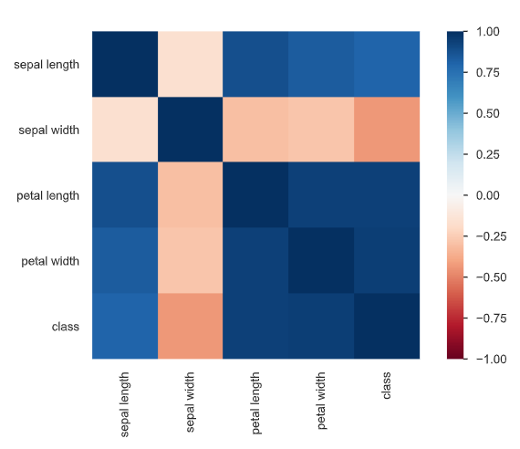
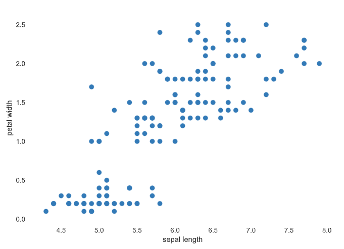
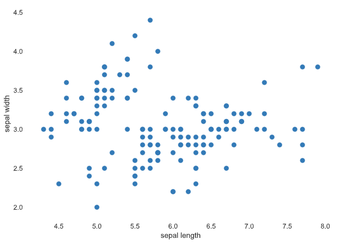

# **Iris ToyProject**

This project is a **Classification model** using the **Iris Dataset**. The model used is a DecisionTree and it is made primarily using **SKlearn**

This project is meant to serve as a sort of ability guaging to see what i can do without googling the solution like crazy.
The project also helped me with building a more **team oriented** mindset and understanding of how i should **structure repositories**, **the code** and this **README file**. So that other people might be able to understand it easier

I've learned alot about **Data analysis**, **Github repositories**, **keeping library imports** low and trying to do things using more common libraries.

## Table of Contents

- [**Iris ToyProject**](#iris-toyproject)
  - [Table of Contents](#table-of-contents)
  - [The libraries used are](#the-libraries-used-are)
  - [Setup](#setup)
    - [Configuration](#configuration)
    - [Installation](#installation)
    - [Uninstall](#uninstall)
  - [How to use the project](#how-to-use-the-project)
    - [You can use this project to do a few different things](#you-can-use-this-project-to-do-a-few-different-things)
    - [Information about the files](#information-about-the-files)
  - [Running the project](#running-the-project)
  - [Dataset](#dataset)
  - [Data Analysis](#data-analysis)
    - [Some Examples of the results from the Profiling Report](#some-examples-of-the-results-from-the-profiling-report)
  - [Credits](#credits)
  - [Sources](#sources)

## The libraries used are

- *Pandas*
- *Pandas Profiling*
- *SKlearn (StratifiedKFold, Preprocessing, Metrics and DecisionTreeClassifier)*
- *Matplotlib Pyplot*
- *Pickle*

## Setup

### Configuration

There is an included config.yaml file under the configuration folder. This file is where you would change different variables easily. Example:

```yaml:
class_names:
  class_nr1: Iris Setosa
  class_nr2: Iris Versicolor
  class_nr3: Iris Virginica
```

### Installation

What is needed to run this project is **Anaconda** or **Miniconda**, both are *open-source* **Python Distribution Platforms** along with those you also need to have Python installed.

When you have Anaconda/Miniconda installed you can follow the instructions below to create an **environment** that is perfect for running the project

To run this project you should create a **Conda Environment** to run it on, this will help with making sure it can run in it's default configuration. This is easily done with the included **Conda Environment** file.
To do so, you should run an Anaconda Prompt(cmd) in administrator mode and use the following code:

```conda:
conda env create -f configuration/irisproject_conda_env.yaml
```

The default name of the environment file is: **irisproject_conda_env.yaml**. This could change if someone changed the name before showing you this project.

When you run the command above it creates a **conda environment** which can be selected as the interpretor when you run one of the python files. It cointains all the libraries you would need to run the project.

### Uninstall

To delete the conda environment you will have to locate where the Anaconda3 folder is, by default it is under: **C:\Users\YourUserHere\Anaconda3\envs**

You then delete the folder that matches the name of the Environment files configured name, by default it's name would be: **Iris_Project_Conda_Environment**

## How to use the project

This is a guide on how to use the project for it's intended purposes

### You can use this project to do a few different things

- *You can use it to predict whether what you write is an Iris Versicolor, Iris Setosa or Iris Virginica.*
- *You can use it to do data analysis on the dataset and figure out things about the original dataset.*
- *You can use it to test your knowledge about models and do some testing with the model.*

To use the project you need to choose the file best suited to what you want to do with the project.

- *If you want the model to predict an Iris you should open the prediction file.*
- *If you want to retrain the model you should use the Training file.*
- *If you want to analyze the dataset then you should use the DataAnalysis file.*

*More information about the files can be found in [Information about the files](#information-about-the-files) below this*

Now that you've chosen the file you want to run you should read some information about the files in the section below. So you can get a better understanding of why they are split up and what the different files do specifically.

### Information about the files

- The project is split into a group of 4 distinctive files all meant to serve a different purpose in the overall project.
- There is the DataAnalysis File which serves to show you information, correlations, maximum and minimum, distributions and so on via a profiling module.
There is also plenty to understand from reading the Console/Terminal printout that the file gives you
- There is the Prediction file which is meant to predict on the saved training model from the Training file, it has a specific format you should write your prediction in,
a maximum and minimum number as well as a datatype, you use it by following the instructions given in the Console/Terminal
- Then there is the training files, there are 2. One of them is completely void of graphs and is mostly supposed to be used when you just want to retrain the model, edit a bit of the parameters
and things like that. The training file that has +graphs in the name is the file that prints out graphs and information about how the KFolded Dataset functions with the DecisionTreeClassifier

You should now head down to the [Running the project](#running-the-project) section and try and run the project for yourself

## Running the project

This section is intended to give you specific commands to run that you can easily copy paste.

All of the below is done in a Anaconda Prompt Terminal and it is assumed that you are running the project from it's folder.

For the Prediction file you can type these commands:

```cmd:
python source/models/IrisClassification-Prediction.py 
```

For the Training file without graphs you can type this command:

```cmd:
python source/models/IrisClassification-Training.py
```

For the Training file that has graphs you can type this command:

```cmd:
python source/models/IrisClassification-Training +graphs.py
```

And for the last file named DataAnalytsis you can type this command:

```cmd:
python source/models/IrisClassification-DataAnalysis.py
```

## Dataset

The dataset used is the Iris Dataset, it's a 5 feature_column dataset that in this case was made without a Header to each column. I added headers for every Column to more easily use the data with Pandas.

The dataset has 3 different classes. By default they are named:

- Iris Setosa
- Iris Versicolor
- Iris Virginica

The Headers are named:

1. sepal length
2. sepal width
3. petal length
4. petal width
5. class

There is a total of 150 Records.

The names was derived from the documentation gathered here: <https://archive.ics.uci.edu/ml/datasets/Iris>

## Data Analysis

I used some Data Analysis tools to learn more about the dataset as a whole. Pandas helped me understand how many records there was and how it was distributed in the dataset. 

Pandas-profling gave me a detailed report about Correlation and Interactions, along with Maximum and Minimum ranges for each feature. This could also be done with Pandas or Scikit-Learn, but it's a lot faster to run a profiling with Pandas-profiling.

### Some Examples of the results from the Profiling Report

- Correlation Matrix:



- Interactions between Sepal Length and Petal Width:



- Interactions between Sepal Length and Sepal Width



## Credits

- Credit to **UCI** for making the dataset widely accessible.
- Credit to **Michele Stawowy** for **Quality Assurance and Guidance**
- Credit to **Martin Riishøj Mathiasen** for the idea to **KFold the Dataset**

## Sources

- Iris Dataset can be found here: <https://archive.ics.uci.edu/ml/datasets/Iris>
- Reference for Folder Structure Inspiration: <https://i0.wp.com/neptune.ai/wp-content/uploads/DL-project-directory.png?resize=938%2C1024&ssl=1>
- DecisionTreeClassifier Inspiration: <https://www.datacamp.com/tutorial/decision-tree-classification-python>

---
